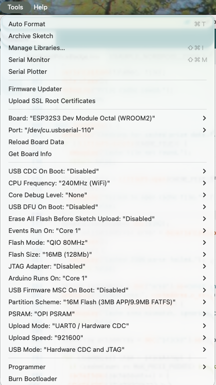
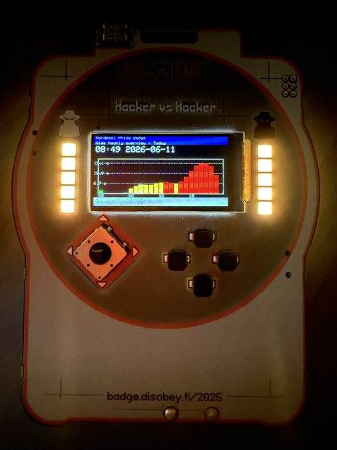

# Nordpool Price Badge

ESP32 Arduino sketch for a wide ST7789 badge that fetches Nordpool electricity prices and displays them with a 24-hour bar chart, color-coded thresholds, and NeoPixel feedback.

## Files

- `NordpoolPriceBadge.ino` — main Arduino sketch
- `LGFX_Config.h` — display configuration for LovyanGFX / ST7789

## Features

- Wi-Fi connection using stored SSID/password
- Nordpool price fetch via `api.spot-hinta.fi`
- Full-day price bar chart and current price display
- Color-coded thresholds and LED ring status
- Settings screen for cheap/moderate thresholds and LED brightness
- Local cache using LittleFS for offline fallback
- Jyväskylä station train screen from Digitraffic (next 6 arrivals/departures)

## Hardware

- Display: ST7789, 320x170
- TFT pins: DC=GPIO15, RST=GPIO7, CS=GPIO6, SCK=GPIO4, MOSI=GPIO5
- NeoPixel data: GPIO18, enable: GPIO17
- Buttons:
  - Up: GPIO11
  - Down: GPIO1
  - Left: GPIO21
  - Right: GPIO2
  - Joystick Press: GPIO14
  - A: GPIO13
  - B: GPIO38
  - Start: GPIO12
  - Select: GPIO45

## Dependencies

- `WiFi` (ESP32 core)
- `HTTPClient`
- `ArduinoJson`
- `LovyanGFX`
- `FastLED`
- `LittleFS`

## Build

1. Open the `NordpoolPriceBadge` sketch in the Arduino IDE or PlatformIO.
2. Select an ESP32 board.
3. 
4. Install the listed libraries if needed.
5. Upload and monitor serial output at 115200.

## Notes

- If Wi-Fi credentials are not saved, the device starts in config mode and will use cache only if available.
- Adjust thresholds and LED brightness from the Start menu.

## Result

## TODO

1. [x] Alternate screen for RSS News reader for Yle Kotimaa news
2. [x] Add VR Jyväskylä Station schedule for arriving and leaving trains (clearly indicated whether leaving or arriving) 
2.1 [x] Handle Digitraffic gzip-compressed API responses.
3. Flight Radar centered for Muurame (small map of muurame borders, and locations of planes on map)
4. [x] Weather Forecast for today and tomorrow with nice visuals
5. [x] Even in the battery saving mode, it should every hour at X:00 update the two leds, without turning the screen or other leds on.
6. [x] Stock info for certain stocks (Price, day change%, day change eur). Here example stocks are (for no particular reason):
  - Elisa
  - Gofore
  - Kesko B
  - Mandatum
  - Nordea Bank
  - Sampo A
  - Tieto
  - OMXHPI
7. Calendar screen (today + next event from Google/ICS export feed)
8. Rain-now screen (simple "rain next 60 min" from FMI/Open-Meteo endpoints)
9. Air quality + pollen screen (single number + color code)
10. Battery/uptime/system health screen (Wi-Fi RSSI, free heap, uptime, last sync)
11. On-this-day trivia screen (daily fact feed)